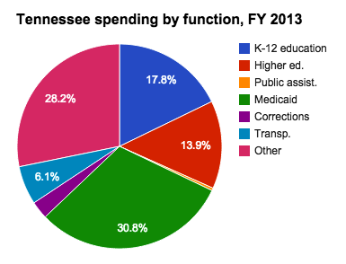

```{r, message = FALSE, warning = FALSE, echo=FALSE}
library("tidyverse")
library("readxl")
library("dplyr")
library("magrittr")
library("ggplot2")
library("GGally")
library("broom")
library("plyr")
library("ggmap")
library("maps")
library("mapdata")
library("rgeos")
library("maptools")
library("sp")
library("raster")
library("rgdal")
library("sf")
library("broom")
library("stringr")

#Reading in all files for the analysis 

irs <- read.csv("data/irs_avg.csv")
edu_raw <- read.csv("data/achievement_profile_data_with_CORE.csv")
merged_irs <- read.csv("data/merged.csv")
edu_act <- read.csv("data/edu_act.csv")
total_sal_2014 <- read.csv("data/total_sal_2014.csv")
usa <- map_data("usa")
states <- map_data("state")
tn_df <- subset(states, region == "tennessee")
counties <- map_data("county")
tn_counties <- subset(counties, region == "tennessee")

```

### Where did the data come from? 

* Academic, demographic, and disciplinary education data gathered from [the 2014 - 2015 TN.gov](https://www.tn.gov/education/data/data-downloads.html).
* Organized zipcodes by county [Zip Codes](https://www.unitedstateszipcodes.org/zip-code-database/).
*  Aggregated tax infomration organized by zipcode [2011 - 2015 IRS Data](https://www.irs.gov/statistics/soi-tax-stats-individual-income-tax-statistics-zip-code-data-soi).

### Brief History of Public Education in TN

* The state's fisrt constitution (1796) did not mention education as an appropriation of public funds.
* The offical recognition of public education came in 1806 within the federal Cession Act, requiring the state to furnish land for two colleges and an academy in each of the 27 existing counties within the state at the time.
* State general assembly statues throughout 1815-1830's proved to be ineffective due to lack of funding.  County boards were independent and uncompensated.
* 1835 state constitution included a education provision, installing a superintendent.
* 1867 Reconstruction intiatives revive resources to be dedicated to education.
* General Education ACt of 1909 - 25% of state gross revenue to be utilized by the counties for public schools.
* 1954 Brown vs Board of Education and resulting desegregation in the years to come.
* 2002 Tennessee Education Lottery ($10.8 million in sales on the first day)
* Common Core Initiative was adopted in 2010 and implemented in 2013. 




```{r echo=FALSE, fig.width=15, fig.height=15}
# data prep for act score for education
edu_act$ACT_Composite_avg <- round((edu_act$ACT_Composite - mean(edu_act$ACT_Composite,na.rm=TRUE))/sd(edu_act$ACT_Composite,na.rm=TRUE), 2)  # compute normalized act scores
edu_act$act_comp_type <- ifelse(edu_act$ACT_Composite_avg < 0, 'below', 'above')  # above / below avg flag
edu_act <- edu_act[order(edu_act$ACT_Composite_avg), ]  # sort
edu_act$county <- factor(edu_act$county, levels = edu_act$county)  # convert to factor to retain sorted order in plot.

# Diverging Barcharts for avg act scores
ggplot(edu_act, aes(x=county, y=ACT_Composite_avg, label= 'ACT Scores')) +
   geom_bar(stat='identity', aes(fill=act_comp_type), width=.5)  +
   scale_fill_manual(name= 'ACT Composite',
                     labels = c('Above Average', 'Below Average'),
                     values = c('above'='#00ba38', 'below'='#f8766d')) +
   labs(subtitle='Diverging Bars Plot',
        title= 'Normalised ACT scores for Counties') +
   coord_flip()
```

```{r echo=FALSE, fig.width=15, fig.height=15}
total_sal_2014$sal_avg_z <- round((total_sal_2014$salary_avg - mean(total_sal_2014$salary_avg,na.rm=TRUE))/sd(total_sal_2014$salary_avg,na.rm=TRUE), 2)  # compute normalized mpg
total_sal_2014$sal_type <- ifelse(total_sal_2014$sal_avg_z < 0, 'below', 'above')  # above / below avg flag
total_sal_2014 <- total_sal_2014[order(total_sal_2014$sal_avg_z), ]  # sort
total_sal_2014$county <- factor(total_sal_2014$county, levels = total_sal_2014$county)  # convert to factor to retain sorted order in plot.

# Diverging Barcharts

ggplot(total_sal_2014, aes(x=county, y=sal_avg_z, label=sal_avg_z)) +
   geom_bar(stat='identity', aes(fill=sal_type), width=.5)  +
   scale_fill_manual(name='Average Salary',
                     labels = c('Above Average', 'Below Average'),
                     values = c('above'='#00ba38', 'below'='#f8766d')) +
   labs(subtitle='Divering Bar Plot',
        title= 'Normalised Average Salary for Counties') +
   coord_flip()
```


### Correlation Matrix of Averaged IRS Data

```{r echo=FALSE, fig.width=15, fig.height=15}

ggcorr(irs)


```

### Correlation Matrix of CORE Education Data

```{r warning=FALSE, message=FALSE, echo=FALSE, fig.width=15, fig.height=15}

edu_2 <- dplyr::select(edu_raw, system_name,BioI,Chemistry,ELA,EngI,EngII,EngIII,AlgI,AlgII,Math,Science,ACT_Composite,Graduation,Pct_Native_American,Pct_SWD,
                Pct_Black,Pct_Hispanic,Pct_EL,Pct_ED,Pct_BHN,Pct_Chronically_Absent,
                Pct_Suspended,Pct_Expelled,Per_Pupil_Expenditures,Enrollment
)
ggcorr(edu_2)

```

```{r echo=FALSE, results='hide', warning=FALSE, message=FALSE}
tn_base <- ggplot(data = tn_df, mapping = aes(x = long, y = lat, group = group)) + 
  coord_fixed(1.3) + 
  geom_polygon(color = "black", fill = "gray")
```

### Per Pupil Expenditure

```{r echo=FALSE, fig.width=25, fig.height=10}

#I need to be able to merge these two to create the ggmap

core <- read.csv("data/merged_county.csv")
colnames(core)[2] <- "subregion" #renaming to match
core[[2]] <- tolower(core[[2]]) #changing to all lowercase

#removing 'county' from the column

core$subregion <- gsub(" county$", "", core$subregion)
tn_counties$subregion <- replace(tn_counties$subregion, tn_counties$subregion=="de kalb", "dekalb")

#merging the two dataframes together with nnner_join

tn_core <- inner_join(tn_counties, core, by = "subregion")

#Attempting to plot

ditch_the_axes <- theme(
  axis.text = element_blank(),
  axis.line = element_blank(),
  axis.ticks = element_blank(),
  panel.border = element_blank(),
  panel.grid = element_blank(),
  axis.title = element_blank()
)

tn_per_pupil <- tn_base + 
  geom_polygon(data = tn_core, aes(fill = Per_Pupil_Expenditures), color = "white") +
  geom_polygon(color = "black", fill = NA) +
  theme_bw() +
  ditch_the_axes

tn_per_pupil
```

### Percentage of Black, Hispanic, and Native American 

```{r echo=FALSE, fig.width=25, fig.height=10}
tn_per_BHN <- tn_base + 
  geom_polygon(data = tn_core, aes(fill = Pct_BHN), color = "white") +
  geom_polygon(color = "black", fill = NA) +
  theme_bw() +
  ditch_the_axes

tn_per_BHN
```

### Graduation Rate

```{r echo=FALSE, fig.width=25, fig.height=10}
tn_graduation <- tn_base + 
  geom_polygon(data = tn_core, aes(fill = Graduation), color = "white") +
  geom_polygon(color = "black", fill = NA) +
  theme_bw() +
  ditch_the_axes

tn_graduation
```

### Dropout Rate

```{r echo=FALSE, fig.width=25, fig.height=10}
tn_dropout <- tn_base + 
  geom_polygon(data = tn_core, aes(fill = Dropout), color = "white") +
  geom_polygon(color = "black", fill = NA) +
  theme_bw() +
  ditch_the_axes

tn_dropout
```

### Model Prediction of Core Scores Effect on ACT Score 

```{r fig.width=15, fig.height=15}

lm(formula = ACT_Composite ~  avg_Eng + avg_Math + avg_Sci + Dropout + Pct_Suspended,  data = merged_irs)
          model_multi <- lm(formula = ACT_Composite ~  avg_Eng + avg_Math + avg_Sci, data = merged_irs)
          plot(model_multi)
          summary(model_multi)
        
           
         
          # use model to predict the results
          test_model <- data.frame(avg_Eng = 80, avg_Math = 80,  avg_Sci = 80)
          test_model2 <- data.frame(avg_Eng = 90, avg_Math = 90,  avg_Sci = 90)
          test_model3 <- data.frame(avg_Eng = 60, avg_Math = 50,  avg_Sci = 60)
          #test_counts <- model_multi$agi_amt_avg
         
          predict(model_multi, test_model)
          predict(model_multi, test_model2)
          predict(model_multi, test_model3)

```

$$ACT_Composite = 12.114030 + 0.095159 * avg_Eng + 0.010742 * avg_Math + 0.016612 * avg_Sci$$